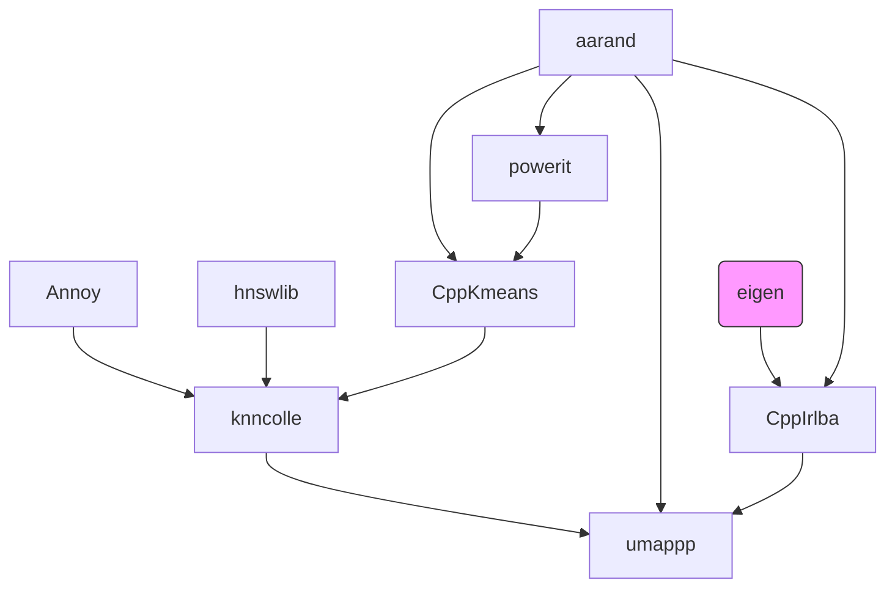

# Umappp - UMAP for Ruby

[](https://github.com/kojix2/ruby-umappp/actions/workflows/ci.yml)
[](https://badge.fury.io/rb/umappp)

🗺️ [Umappp](https://github.com/LTLA/umappp) - Uniform Manifold Approximation and Projection - for Ruby


> Uniform Manifold Approximation and Projection (UMAP) is a dimension reduction technique that can be used for visualisation similarly to t-SNE, but also for general non-linear dimension reduction. 
> ([original UMAP documentation](https://umap-learn.readthedocs.io/en/latest/index.html))

* Ruby Umappp is a wrapper library for [C++ Umappp library](https://github.com/LTLA/umappp) created by Aaron Lun 
* Compatible with [yaumap](https://github.com/LTLA/yaumap)
* Support [Numo::NArray](https://github.com/ruby-numo/numo-narray)

## Installation


```
gem install umappp
```

* [OpenMP](https://www.openmp.org) is required for multithreading.

## Usage

This Gem provides the module `Umappp` and its singular method `Umappp.run()`. The first argument of `Umappp.run()` is a two-dimensional Ruby array or a two-dimensional Numo array. [Numo](https://github.com/ruby-numo/numo-narray) is a library for performing N-dimensional array computing like NumPy. The argument is converted to `Numo::SFloat`. SFloat is a single precision floating point number type of Numo::NArray.

```ruby
Umappp.run(embedding) # embedding is two-dimensional Ruby array or Numo array

# with parameters
Umappp.run(pixels, num_threads: 8, a: 1.8956, b: 0.8006)
```

Available parameters and their default values

| parameters           | default value                      |
|----------------------|------------------------------------|
| method               | :annoy (another option is :vptree) |
| ndim                 | 2                                  |
| tick                 | 0 (Not yet implemented)            |
| local_connectivity   | 1.0                                |
| bandwidth            | 1                                  |
| mix_ratio            | 1                                  |
| spread               | 1                                  |
| min_dist             | 0.01                               |
| a                    | 0                                  |
| b                    | 0                                  |
| repulsion_strength   | 1                                  |
| num_epochs           | 500                                |
| learning_rate        | 1                                  |
| negative_sample_rate | 5                                  |
| num_neighbors        | 15                                 |
| seed                 | 1234567890                         |
| batch                | false                              |
| num_threads          | 1 (OpenMP required)                |

## Development

```
git clone https://github.com/kojix2/ruby-umappp
cd umap
b ndle dle exec rake compile
bundle exec rake test
```

### Ruby dependencies

* [rice](https://github.com/jasonroelofs/rice) - Ruby Interface for C++ Extensions
* [numo.hpp](https://github.com/ankane/numo.hpp) - C++ header for Numo and Rice

### Umappp dependencies

This Gem is a wrapper for [Umappp](https://github.com/LTLA/umappp). We store and distribute Umappp and other dependent C++ code in the Vendor directory. Umappp is compiled when the Gem is installed. Umappp's C++ modules have complex dependencies as shown in the figure below. It is not a good idea to manage them manually. Use `script/vendor.sh` to update them automatically. This actually runs cmake and moves the required directories to the vendor directory.




All modules except eigen are the work of Aaron Lun.

## Contributing

Welcome!

    Do you need commit rights to my repository?
    Do you want to get admin rights and take over the project?
    If so, please feel free to contact us @kojix2.

## License

* As for the code I wrote, it is  BSD 2-Clause (or MIT).
* The license of Umappp for C++ by Aaron Lun is BSD 2-Clause.
* For other codes, please check on your own. (There are many dependencies)
 
