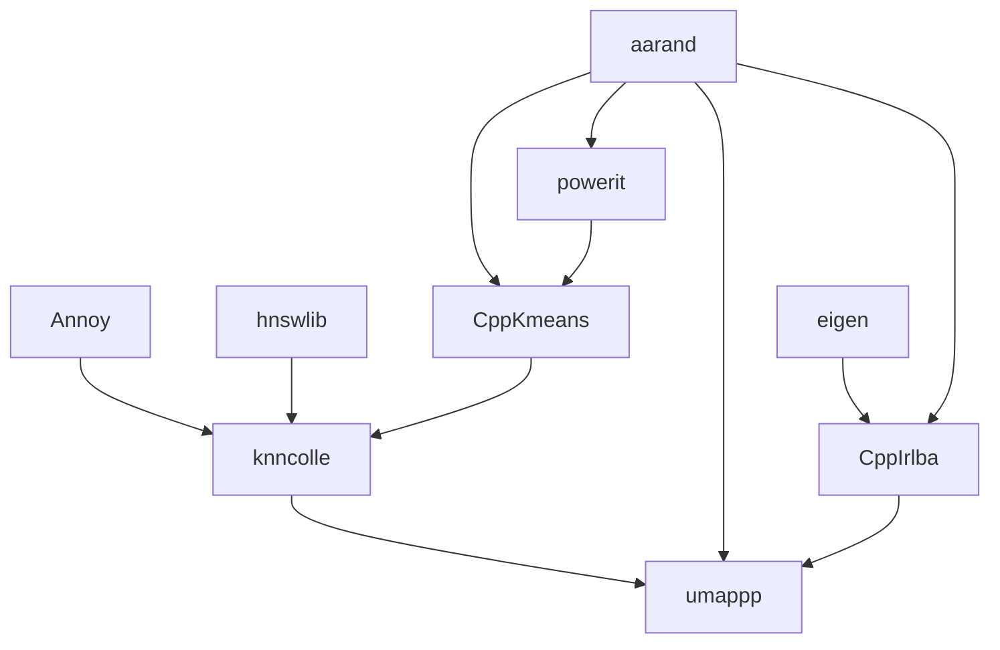

# Umappp for Ruby


🗺️ [Umappp](https://github.com/LTLA/umappp) - Uniform Manifold Approximation and Projection - for Ruby

* Compatible with [yaumap](https://github.com/LTLA/yaumap)
* Support [Numo::NArray](https://github.com/ruby-numo/numo-narray)

🚧 alpha - Still in development.

## Installation

```
git clone https://github.com/kojix2/umappp
cd umappp
rake compile
rake install
```

* [OpenMP](https://www.openmp.org) is required for multithreading.

## Usage

```ruby
Umap.run(pixels, nthreads: 4)
```

Parameters and default values

```markdown
- method               : :annoy (another option is vptree)
- ndim                 : 2
- nthreads             : 2 (OpenMP required)
- tick                 : 0 (Not yet implemented)

<umappp parameters>

- local_connectivity   : 1.0
- bandwidth            : 1
- mix_ratio            : 1
- spread               : 1
- min_dist             : 0.01
- a                    : 0
- b                    : 0
- repulsion_strength   : 1
- num_epochs           : 500
- learning_rate        : 1
- negative_sample_rate : 5
- num_neighbors        : 15
- seed                 : 1234567890
- batch                : false
```

## Development

* [numo.hpp](https://github.com/ankane/numo.hpp)
* [rice](https://github.com/jasonroelofs/rice)

Umappp's C++ modules have complex dependencies as shown in the figure below. It is not a good idea to manage them manually. Use `script/vendor.sh` to update them automatically.



## Contributing

Welcome!

    Do you need commit rights to my repository?
    Do you want to get admin rights and take over the project?
    If so, please feel free to contact us @kojix2.

## License

* As for the code I wrote, it is MIT.
* For other codes, please check on your own. (There are many dependencies)
